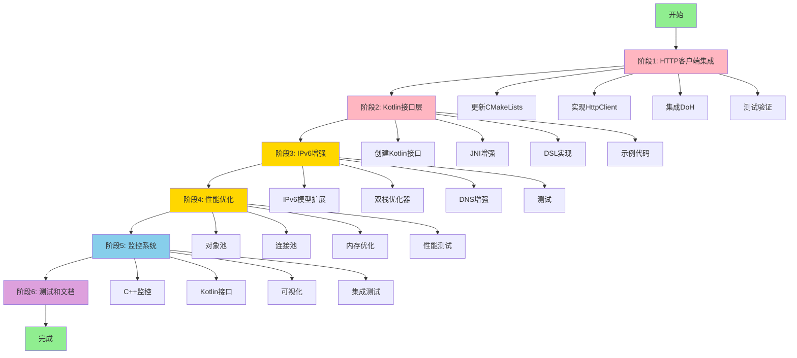
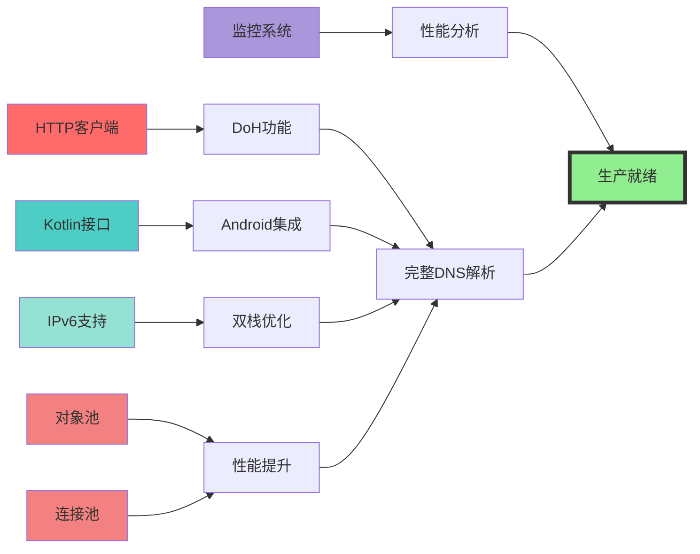
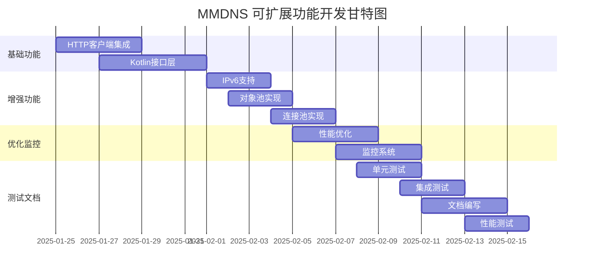

# MMDNS 可扩展功能实施路线图

## 📊 实施流程图



## 🎯 核心功能依赖关系



## 📅 详细时间表

### Week 1: 基础功能

| 天 | 任务 | 产出 | 状态 |
|----|------|------|------|
| Day 1-2 | HTTP客户端集成 | MMDNSHttpClient.h/cpp | ⏳ |
| Day 3-4 | DoH实现 | DoH请求/响应解析 | ⏳ |
| Day 5-7 | Kotlin接口基础 | MMDNSManager.kt | ⏳ |

### Week 2: 增强功能

| 天 | 任务 | 产出 | 状态 |
|----|------|------|------|
| Day 8-10 | Kotlin DSL | 配置DSL和扩展 | ⏳ |
| Day 11-12 | IPv6支持 | 双栈优化器 | ⏳ |
| Day 13-14 | 对象池 | ObjectPool实现 | ⏳ |

### Week 3: 优化和监控

| 天 | 任务 | 产出 | 状态 |
|----|------|------|------|
| Day 15-16 | 连接池 | ConnectionPool实现 | ⏳ |
| Day 17-18 | 监控系统 | MMDNSMonitor实现 | ⏳ |
| Day 19-21 | 性能优化 | 各项优化措施 | ⏳ |

### Week 4: 测试和文档

| 天 | 任务 | 产出 | 状态 |
|----|------|------|------|
| Day 22-24 | 测试 | 单元/集成/性能测试 | ⏳ |
| Day 25-27 | 文档 | API文档和使用指南 | ⏳ |
| Day 28 | 发布准备 | 版本发布 | ⏳ |

## 🔄 并行开发流程



## 🎨 架构演进

### 当前架构 (V1.0)
```
┌──────────────────────────────┐
│      MMDNSEntrance           │
├──────────────────────────────┤
│      MMDNSServer             │
├──────────────────────────────┤
│  SystemDNS | HttpDNS(框架)   │
├──────────────────────────────┤
│  Socket | Ping | Cache       │
└──────────────────────────────┘
```

### 目标架构 (V2.0)
```
┌──────────────────────────────────────────────┐
│           Kotlin API Layer                   │
│  (MMDNSManager + DSL + Coroutines)          │
├──────────────────────────────────────────────┤
│              JNI Bridge                      │
│  (Enhanced Callbacks + Thread Safety)        │
├──────────────────────────────────────────────┤
│           MMDNSEntrance                      │
│    (Single Entry Point)                      │
├──────────────────────────────────────────────┤
│           MMDNSServer                        │
│  (Thread Pool + Task Queue + Monitor)        │
├──────────────────────────────────────────────┤
│   SystemDNS | HttpDNS(libcurl) | LocalCache  │
│           (DNS Resolution Layer)             │
├──────────────────────────────────────────────┤
│  DualStackOptimizer | SpeedChecker           │
│     (IPv4/IPv6 Optimization)                 │
├──────────────────────────────────────────────┤
│  ObjectPool | ConnectionPool                 │
│     (Resource Management)                    │
├──────────────────────────────────────────────┤
│  Socket | Ping | HttpClient | Cache          │
│       (Network & Storage Layer)              │
└──────────────────────────────────────────────┘
            ↓
    ┌───────────────┐
    │   Monitoring  │
    │    System     │
    └───────────────┘
```

## 📦 交付物清单

### C++ 层
- [ ] `MMDNSHttpClient.h` - HTTP客户端头文件
- [ ] `MMDNSHttpClient.cpp` - HTTP客户端实现
- [ ] `MMDNSDualStackOptimizer.h` - 双栈优化器头文件
- [ ] `MMDNSDualStackOptimizer.cpp` - 双栈优化器实现
- [ ] `MMDNSObjectPool.h` - 对象池模板
- [ ] `MMDNSConnectionPool.h` - 连接池头文件
- [ ] `MMDNSConnectionPool.cpp` - 连接池实现
- [ ] `MMDNSMonitor.h` - 监控系统头文件
- [ ] `MMDNSMonitor.cpp` - 监控系统实现
- [ ] 更新 `MMDNSIPModel.h/cpp` - IPv6增强
- [ ] 更新 `MMDNSServerHandle.cpp` - DoH集成
- [ ] 更新 `CMakeLists.txt` - 库链接配置

### Kotlin 层
- [ ] `MMDNSManager.kt` - 主要管理类
- [ ] `MMDNSConfig.kt` - 配置DSL
- [ ] `MMDNSMonitor.kt` - 监控接口
- [ ] `MMDNSExtensions.kt` - Kotlin扩展
- [ ] `DNSCallback.kt` - 回调接口
- [ ] `DNSModels.kt` - 数据模型

### 测试
- [ ] `HttpClientTest.cpp` - HTTP客户端单元测试
- [ ] `IPv6Test.cpp` - IPv6功能测试
- [ ] `ObjectPoolTest.cpp` - 对象池测试
- [ ] `PerformanceTest.cpp` - 性能基准测试
- [ ] `TestKotlinAPI.kt` - Kotlin API测试
- [ ] `IntegrationTest.kt` - 集成测试

### 文档
- [ ] `API.md` - API参考文档
- [ ] `PERFORMANCE.md` - 性能指南
- [ ] `MIGRATION.md` - 迁移指南
- [ ] `ARCHITECTURE.md` - 架构文档
- [ ] 更新 `README.md` - 项目说明

## 🚀 快速启动指南

### 开发环境准备
```bash
# 1. 确保NDK环境
export ANDROID_NDK=/path/to/ndk

# 2. 检查prebuilt库
ls -la Thread-P2P-Module/prebuilt/arm64-v8a/lib/

# 3. 编译测试
cd Thread-P2P-Module/cpp/dns
mkdir build && cd build
cmake ..
make
```

### 第一步: HTTP客户端集成
1. 更新 [`CMakeLists.txt`](Thread-P2P-Module/cpp/dns/CMakeLists.txt)
2. 创建 `include/MMDNSHttpClient.h`
3. 实现 `src/MMDNSHttpClient.cpp`
4. 修改 [`MMDNSServerHandle.cpp`](Thread-P2P-Module/cpp/dns/src/MMDNSServerHandle.cpp)
5. 编写单元测试

### 第二步: Kotlin接口
1. 创建 `jni/MMDNSManager.kt`
2. 增强 [`mmdns_jni.cpp`](Thread-P2P-Module/cpp/dns/jni/mmdns_jni.cpp)
3. 实现回调机制
4. 编写示例代码

## 📊 成功指标

### 功能指标
- ✅ DoH成功率 > 95%
- ✅ IPv6解析正常工作
- ✅ 对象池复用率 > 70%
- ✅ 连接池命中率 > 80%

### 性能指标
- ✅ 解析时间 < 目标值
- ✅ 内存使用 < 10MB
- ✅ CPU使用 < 5%
- ✅ 并发支持 > 1000 QPS

### 质量指标
- ✅ 单元测试覆盖率 > 80%
- ✅ 集成测试通过率 100%
- ✅ 代码审查通过
- ✅ 文档完整性 100%

## 🔍 风险评估

| 风险 | 影响 | 概率 | 缓解措施 |
|------|------|------|----------|
| libcurl集成困难 | 高 | 中 | 提前验证,准备备选方案 |
| JNI回调稳定性 | 中 | 中 | 充分测试,添加异常处理 |
| 性能优化效果不佳 | 中 | 低 | 基准测试,迭代优化 |
| IPv6兼容性问题 | 低 | 中 | 多环境测试 |
| 时间延期 | 中 | 中 | 优先级管理,并行开发 |

## 📞 技术支持

### 关键决策点
1. **Week 1 结束**: HTTP DNS是否可用?
2. **Week 2 结束**: Kotlin API是否稳定?
3. **Week 3 结束**: 性能是否达标?
4. **Week 4 结束**: 是否可以发布?

### 检查点
- [ ] Day 7: HTTP DNS Demo可运行
- [ ] Day 14: Kotlin示例程序完成
- [ ] Day 21: 性能测试通过
- [ ] Day 28: 所有测试通过,文档完整

---

**文档版本**: 1.0  
**创建日期**: 2025-01-25  
**状态**: 📋 规划中