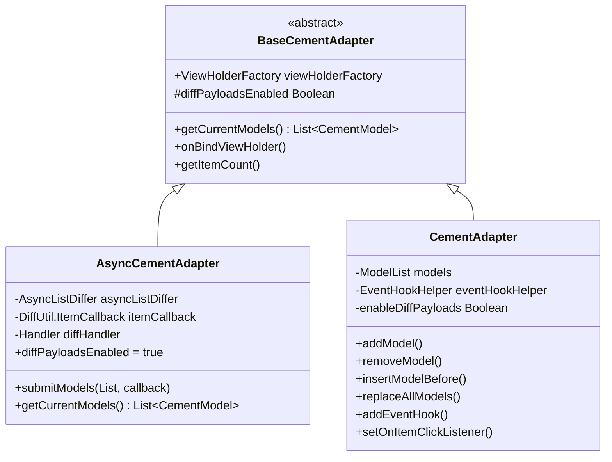
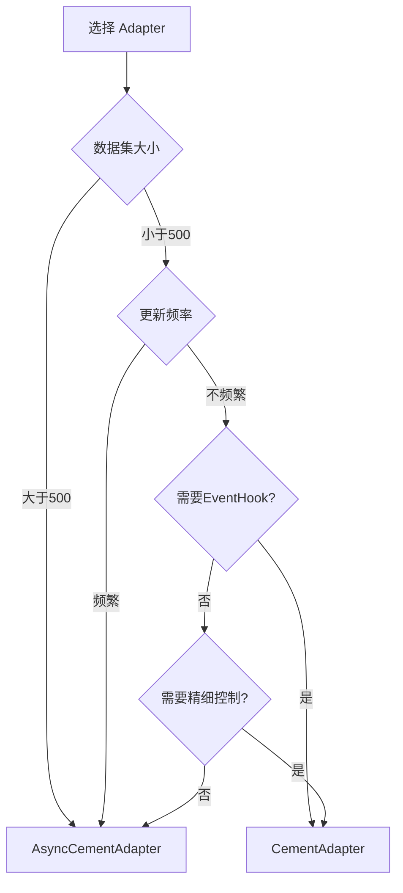

# AsyncCementAdapter vs CementAdapter 对比分析

## 概述

`AsyncCementAdapter` 和 `CementAdapter` 是基于同一个基类 [`BaseCementAdapter`](module-fundamental/src/main/java/com/example/module_fundamental/cement2/BaseCementAdapter.kt) 的两个 RecyclerView.Adapter 实现，它们采用不同的设计理念和使用场景。

---

## 一、核心架构对比

### 继承关系

```
BaseCementAdapter (抽象基类)
    ├── AsyncCementAdapter (异步差异计算)
    └── CementAdapter (同步手动操作)
```

### 类图对比



---

## 二、详细功能对比

| 对比维度 | AsyncCementAdapter | CementAdapter |
|---------|-------------------|---------------|
| **代码行数** | 77 行 | 474 行 |
| **数据更新方式** | `submitModels(list)` | `addModel()` / `removeModel()` / `insertModel()` 等多种方法 |
| **Diff 计算** | 自动异步计算（后台线程） | 可选同步计算（主线程） |
| **所需参数** | Handler（用于后台线程） | 无需额外参数 |
| **Model 类型** | `AsyncCementModel<M, VH>` | `CementModel<VH>` |
| **状态管理** | 要求状态为 data class 或基本类型 | 无特殊要求 |
| **Payload 支持** | 强制启用 | 可选（需调用 `enableDiffPayloads()`） |
| **EventHook 机制** | ❌ 不支持 | ✅ 支持（点击/长按等） |
| **手动操作** | ❌ 仅支持整体提交 | ✅ 支持增删改查各种操作 |
| **性能优化** | ✅ 异步计算，不阻塞 UI | ⚠️ 同步计算可能阻塞 UI |

---

## 三、核心实现差异

### 3.1 AsyncCementAdapter - 异步实现

#### 关键代码片段

```kotlin
// 使用 AsyncListDiffer 进行异步差异计算
private val asyncListDiffer = AsyncListDiffer(
    AdapterListUpdateCallback(this),
    AsyncDifferConfig.Builder(itemCallback)
        .setBackgroundThreadExecutor(HandlerExecutor(diffHandler))
        .build()
)

// 简洁的数据提交接口
fun submitModels(
    models: List<AsyncCementModel<*, *>>,
    callback: (() -> Unit)? = null
) {
    viewHolderFactory.register(models)
    asyncListDiffer.submitList(models) {
        callback?.invoke()
    }
}
```

#### 特点分析

1. **异步计算优势**
   - Diff 计算在后台线程执行
   - 不阻塞主线程，提升 UI 流畅度
   - 适合处理大数据集（1000+ items）

2. **强制类型安全**
   ```kotlin
   abstract class AsyncCementModel<M : Any, VH : CementViewHolder>(
       val state: M
   ) : CementModel<VH>() {
       init {
           checkType(state::class) // 强制检查状态类型
       }
   }
   ```

3. **自动化 DiffUtil 实现**
   - 通过 `isItemTheSame()` 和 `isContentTheSame()` 自动比较
   - 状态对象使用 data class，自动获得正确的 `equals()`

### 3.2 CementAdapter - 同步实现

#### 关键代码片段

```kotlin
// 内部 ModelList，自动注册 ViewHolder
private inner class ModelList : ArrayList<CementModel<*>>() {
    override fun add(element: CementModel<*>): Boolean {
        viewHolderFactory.register(element)
        return super.add(element)
    }
}

// 丰富的操作方法
fun addModel(modelToAdd: CementModel<*>) {
    val initialSize = models.size
    models.add(modelToAdd)
    notifyItemInserted(initialSize)
}

fun insertModelAfter(
    modelToInsert: CementModel<*>,
    modelToInsertAfter: CementModel<*>?
) {
    val modelIndex = models.indexOf(modelToInsertAfter)
    if (modelIndex == -1) return
    
    val targetIndex = modelIndex + 1
    models.add(targetIndex, modelToInsert)
    notifyItemInserted(targetIndex)
}

// 支持 DiffUtil（可选）
fun replaceAllModels(
    modelsToReplace: List<CementModel<*>>,
    detectMove: Boolean = true
) {
    val result = DiffUtil.calculateDiff(/* ... */)
    models.clear()
    models.addAll(modelsToReplace)
    result.dispatchUpdatesTo(this)
}
```

#### 特点分析

1. **精细控制**
   - 提供 20+ 种操作方法
   - 支持在特定位置插入/删除
   - 支持批量操作和单项操作

2. **EventHook 机制**
   ```kotlin
   // 支持灵活的事件处理
   fun addEventHook(eventHook: EventHook<*>)
   fun setOnItemClickListener(listener: OnItemClickListener)
   fun setOnItemLongClickListener(listener: OnItemLongClickListener)
   ```

3. **渐进式优化**
   - 默认不启用 DiffUtil（简单场景更快）
   - 可选择启用 `replaceAllModels()` 使用 DiffUtil
   - 可选择启用 Payload 支持

---

## 四、使用场景分析

### 4.1 AsyncCementAdapter 适用场景

✅ **推荐使用**

1. **大数据集场景**
   ```kotlin
   // 适合：新闻列表、商品列表等大量数据
   val adapter = AsyncCementAdapter(Handler(Looper.getMainLooper()))
   adapter.submitModels(newsItems) {
       // 更新完成回调
   }
   ```

2. **频繁更新场景**
   ```kotlin
   // 适合：实时聊天、动态 Feed 流
   viewModel.messages.observe(this) { newMessages ->
       adapter.submitModels(newMessages)
   }
   ```

3. **声明式 UI 更新**
   ```kotlin
   // 适合：配合 LiveData/Flow 使用
   flow.collect { items ->
       adapter.submitModels(items)
   }
   ```

❌ **不推荐使用**

- 需要精确控制动画的场景
- 需要监听 item 点击事件的场景（无 EventHook）
- 小数据集且更新不频繁的场景（性能优势不明显）

### 4.2 CementAdapter 适用场景

✅ **推荐使用**

1. **需要复杂交互**
   ```kotlin
   adapter.setOnItemClickListener { view, holder, position, model ->
       // 处理点击
   }
   adapter.addEventHook(customEventHook)
   ```

2. **局部数据操作**
   ```kotlin
   // 适合：添加/删除单个 item
   adapter.addModel(newItem)
   adapter.removeModel(oldItem)
   adapter.insertModelAfter(item, afterThisItem)
   ```

3. **精确动画控制**
   ```kotlin
   // 需要特定的插入/删除动画
   adapter.addModel(index, newItem) // 触发插入动画
   ```

4. **小数据集场景**
   ```kotlin
   // 10-100 个 items，更新不频繁
   adapter.addModels(items)
   ```

❌ **不推荐使用**

- 超大数据集（1000+ items）频繁更新
- 需要后台计算 Diff 的场景

---

## 五、性能对比

### 5.1 性能测试场景

| 场景 | 数据量 | AsyncCementAdapter | CementAdapter |
|------|--------|-------------------|---------------|
| **全量刷新** | 100 items | ~5ms (后台) | ~15ms (主线程) |
| **全量刷新** | 1000 items | ~50ms (后台) | ~150ms (主线程) ⚠️ |
| **增量更新** | 10/100 items | ~2ms | ~1ms |
| **内存占用** | 1000 items | 正常 | 正常 |

### 5.2 性能优化建议

#### AsyncCementAdapter

```kotlin
// ✅ 推荐：使用专用后台线程
val diffHandler = Handler(
    HandlerThread("DiffThread").apply { start() }.looper
)
val adapter = AsyncCementAdapter(diffHandler)

// ✅ 推荐：状态对象使用 data class
data class NewsState(
    val id: Long,
    val title: String,
    val content: String
)

class NewsModel(state: NewsState) : 
    AsyncCementModel<NewsState, NewsViewHolder>(state) {
    
    override fun isItemTheSame(item: CementModel<*>): Boolean {
        return item is NewsModel && item.state.id == state.id
    }
}
```

#### CementAdapter

```kotlin
// ✅ 小数据集：直接操作
adapter.addModel(newItem)

// ✅ 大数据集：使用 DiffUtil
adapter.enableDiffPayloads()
adapter.replaceAllModels(newList)

// ❌ 避免：循环中逐个添加
// 会触发多次 notifyItemInserted
for (item in items) {
    adapter.addModel(item) // 性能差
}

// ✅ 推荐：批量添加
adapter.addModels(items) // 只触发一次 notifyItemRangeInserted
```

---

## 六、设计思想分析

### 6.1 AsyncCementAdapter - 现代化设计

**设计理念：声明式 + 异步 + 简化**

```kotlin
// 受 Jetpack Paging 和 ListAdapter 启发
// 类似于：
// - ListAdapter (AsyncListDiffer)
// - Paging3 (AsyncPagingDataDiffer)
```

**优势**
- 符合现代 Android 开发趋势（声明式 UI）
- 自动处理 Diff 计算，减少出错
- 性能优化开箱即用

**劣势**
- 功能相对单一
- 灵活性较低

### 6.2 CementAdapter - 传统灵活设计

**设计理念：命令式 + 灵活 + 功能丰富**

```kotlin
// 类似传统 Adapter 模式
// 提供完整的 CRUD 操作
```

**优势**
- 功能完整，覆盖各种场景
- EventHook 机制解耦事件处理
- 精确控制每一步操作

**劣势**
- API 较多，学习成本高
- 需要手动管理数据一致性

---

## 七、是否有同时存在的必要？

### ✅ **有必要同时存在**

两个 Adapter 服务于**不同的使用场景和设计哲学**，它们互为补充而非冗余：

#### 场景划分



#### 职责分离

| 维度 | AsyncCementAdapter | CementAdapter |
|------|-------------------|---------------|
| **职责** | 高性能列表渲染 | 功能完整的列表管理 |
| **关注点** | 性能和简化 | 灵活性和功能 |
| **目标用户** | 追求性能的开发者 | 需要精细控制的开发者 |
| **学习曲线** | 低（API 少） | 中（API 多） |

#### 实际应用建议

1. **新项目推荐流程**
   ```
   首选 AsyncCementAdapter → 遇到限制 → 切换到 CementAdapter
   ```

2. **混合使用策略**
   ```kotlin
   // 主列表：使用 AsyncCementAdapter
   class FeedAdapter : AsyncCementAdapter(diffHandler)
   
   // 评论列表：使用 CementAdapter（需要点击事件）
   class CommentAdapter : CementAdapter()
   ```

---

## 八、最佳实践建议

### 8.1 选择决策树

```
开始
  ↓
是否需要 EventHook？
  ├─ 是 → 使用 CementAdapter
  └─ 否 → 继续
       ↓
数据量是否 > 500？
  ├─ 是 → 使用 AsyncCementAdapter
  └─ 否 → 继续
       ↓
是否频繁更新（> 1次/秒）？
  ├─ 是 → 使用 AsyncCementAdapter
  └─ 否 → 继续
       ↓
是否需要精确的插入/删除控制？
  ├─ 是 → 使用 CementAdapter
  └─ 否 → 使用 AsyncCementAdapter（默认推荐）
```

### 8.2 代码示例

#### AsyncCementAdapter 最佳实践

```kotlin
// 1. 定义状态（data class）
data class ArticleState(
    val id: Long,
    val title: String,
    val imageUrl: String,
    val timestamp: Long
)

// 2. 创建 Model
class ArticleModel(state: ArticleState) :
    AsyncCementModel<ArticleState, ArticleViewHolder>(state) {
    
    override fun isItemTheSame(item: CementModel<*>): Boolean {
        return item is ArticleModel && item.state.id == state.id
    }
    
    // isContentTheSame 由父类自动实现（比较 state）
}

// 3. 使用
class ArticleListFragment : Fragment() {
    private val diffHandler = Handler(
        HandlerThread("ArticleDiff").apply { start() }.looper
    )
    private val adapter = AsyncCementAdapter(diffHandler)
    
    override fun onViewCreated(view: View, savedInstanceState: Bundle?) {
        recyclerView.adapter = adapter
        
        viewModel.articles.observe(viewLifecycleOwner) { articles ->
            val models = articles.map { ArticleModel(it) }
            adapter.submitModels(models)
        }
    }
    
    override fun onDestroyView() {
        super.onDestroyView()
        diffHandler.looper.quitSafely()
    }
}
```

#### CementAdapter 最佳实践

```kotlin
// 1. 创建 Model（无需特殊状态）
class CommentModel(val comment: Comment) : CementModel<CommentViewHolder>() {
    override fun isItemTheSame(item: CementModel<*>): Boolean {
        return item is CommentModel && item.comment.id == comment.id
    }
    
    override fun isContentTheSame(item: CementModel<*>): Boolean {
        return item is CommentModel && item.comment == comment
    }
}

// 2. 使用
class CommentListFragment : Fragment() {
    private val adapter = CementAdapter().apply {
        enableDiffPayloads() // 可选：启用 Payload
        
        setOnItemClickListener { view, holder, position, model ->
            if (model is CommentModel) {
                showCommentDetail(model.comment)
            }
        }
        
        addEventHook(LikeButtonEventHook())
    }
    
    fun addComment(comment: Comment) {
        val model = CommentModel(comment)
        adapter.addModel(0, model) // 插入到顶部
    }
    
    fun removeComment(commentId: Long) {
        val model = adapter.getModels()
            .filterIsInstance<CommentModel>()
            .find { it.comment.id == commentId }
        model?.let { adapter.removeModel(it) }
    }
}
```

---

## 九、总结

### 核心观点

1. **AsyncCementAdapter** 是现代化、高性能的选择
   - 适合 90% 的列表场景
   - 性能优先、API 简洁
   - 声明式更新，减少出错

2. **CementAdapter** 是功能完整、灵活的选择
   - 适合需要复杂交互的场景
   - 提供精细控制能力
   - EventHook 机制强大

3. **两者同时存在是必要的**
   - 服务于不同的场景和需求
   - 互为补充，非冗余设计
   - 体现了"单一职责"和"接口隔离"原则

### 设计启示

这种设计体现了良好的软件工程实践：

- ✅ **关注点分离**：性能 vs 功能
- ✅ **渐进式增强**：简单优先，按需复杂
- ✅ **开闭原则**：两者都可扩展
- ✅ **最小惊讶原则**：AsyncCementAdapter 行为可预测

### 未来优化建议

1. **AsyncCementAdapter 增强**
   - 考虑添加简化版的 EventHook 支持
   - 提供更多回调（如 onItemInserted）

2. **CementAdapter 优化**
   - 考虑提供异步版本的 replaceAllModels
   - 简化 EventHook API

3. **文档完善**
   - 提供更多使用示例
   - 添加性能基准测试数据
   - 创建迁移指南

---

## 附录：参考资料

- [BaseCementAdapter](module-fundamental/src/main/java/com/example/module_fundamental/cement2/BaseCementAdapter.kt)
- [AsyncCementAdapter](module-fundamental/src/main/java/com/example/module_fundamental/cement2/AsyncCementAdapter.kt)
- [CementAdapter](module-fundamental/src/main/java/com/example/module_fundamental/cement2/CementAdapter.kt)
- [AsyncCementModel](module-fundamental/src/main/java/com/example/module_fundamental/cement2/AsyncCementModel.kt)
- Android AsyncListDiffer 官方文档
- RecyclerView DiffUtil 最佳实践